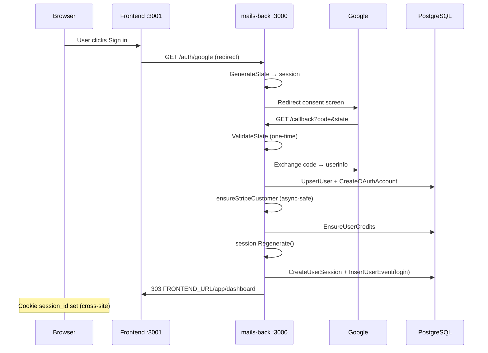
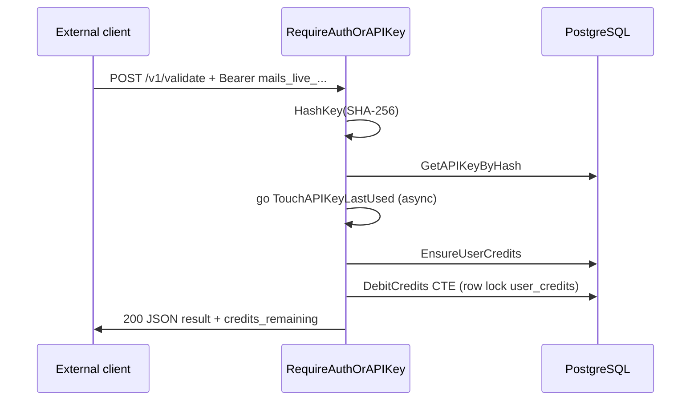
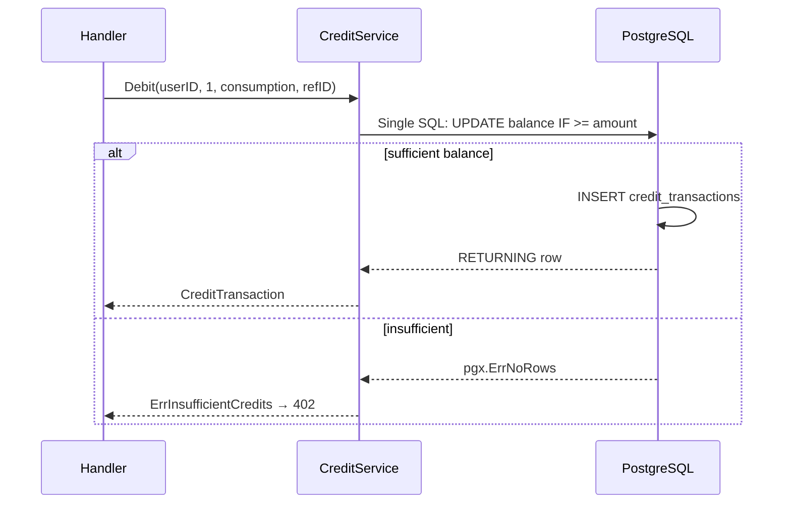

# mails.com — Architecture & Scalability Audit

**Date:** June 2026  
**Scope:** `mails-backend` (`mails-com/back`) + `mails-frontend` (`mails-com/front`)  
**Repos:** Fly.io API + Cloudflare Workers SPA  
**Status:** Production (API keys, credits ledger, dummy validate live)

This report consolidates three audits performed in June 2026:

1. **Full-stack industry-standard review** (frontend + backend overview)
2. **Deep backend analysis** (handlers, SQL, security, concurrency)
3. **Cross-stack integration & scalability** (synthesis + roadmap)

---

## Table of contents

1. [Executive summary](#1-executive-summary)
2. [Topology](#2-topology)
3. [Backend — stack & architecture](#3-backend--stack--architecture)
4. [Backend — database](#4-backend--database)
5. [Backend — domains (auth, credits, API keys, validate, billing)](#5-backend--domains)
6. [Backend — security](#6-backend--security)
7. [Backend — API design](#7-backend--api-design)
8. [Backend — concurrency & scalability](#8-backend--concurrency--scalability)
9. [Backend — testing, CI, ops](#9-backend--testing-ci-ops)
10. [Frontend — stack & architecture](#10-frontend--stack--architecture)
11. [Frontend — API client & contracts](#11-frontend--api-client--contracts)
12. [Frontend — UI, i18n, SEO](#12-frontend--ui-i18n-seo)
13. [Frontend — testing, CI, deploy](#13-frontend--testing-ci-deploy)
14. [Cross-stack integration](#14-cross-stack-integration)
15. [Scorecard](#15-scorecard)
16. [What you have that many startups skip](#16-what-you-have-that-many-startups-skip)
17. [Gaps & technical debt (concrete)](#17-gaps--technical-debt-concrete)
18. [Scalability model](#18-scalability-model)
19. [Priority roadmap](#19-priority-roadmap)
20. [File reference index](#20-file-reference-index)

**Extended sections (Part II):**

21. [Complete API reference](#21-complete-api-reference)
22. [Sequence diagrams — critical flows](#22-sequence-diagrams--critical-flows)
23. [Entity-relationship model](#23-entity-relationship-model)
24. [sqlc query catalog](#24-sqlc-query-catalog)
25. [Backend code inventory (every file)](#25-backend-code-inventory-every-file)
26. [Frontend code inventory](#26-frontend-code-inventory)
27. [Environment variables](#27-environment-variables)
28. [Production vs development](#28-production-vs-development)
29. [Threat model](#29-threat-model)
30. [Failure modes & operations runbook](#30-failure-modes--operations-runbook)
31. [Load & attack test results](#31-load--attack-test-results)
32. [HTTP status & error code matrix](#32-http-status--error-code-matrix)
33. [Future architecture options](#33-future-architecture-options)
34. [Glossary](#34-glossary)

**Extended sections (Part III — full detail):**

35. [Complete migration changelog](#35-complete-migration-changelog)
36. [HTTP middleware pipeline](#36-http-middleware-pipeline)
37. [OAuth & session deep dive](#37-oauth--session-deep-dive)
38. [Credits ledger — full specification](#38-credits-ledger--full-specification)
39. [API keys — full specification](#39-api-keys--full-specification)
40. [Validate endpoint — full specification](#40-validate-endpoint--full-specification)
41. [Every endpoint — request/response examples](#41-every-endpoint--requestresponse-examples)
42. [Frontend — loaders, state, and UX patterns](#42-frontend--loaders-state-and-ux-patterns)
43. [i18n & SEO inventory](#43-i18n--seo-inventory)
44. [CI pipelines (step-by-step)](#44-ci-pipelines-step-by-step)
45. [Local development bootstrap](#45-local-development-bootstrap)
46. [attack-credits.sh — complete scenario catalog](#46-attack-creditssh--complete-scenario-catalog)
47. [Frontend component tree](#47-frontend-component-tree)
48. [Dependency version matrix](#48-dependency-version-matrix)
49. [Known quirks & implementation notes](#49-known-quirks--implementation-notes)
50. [Data retention & compliance notes](#50-data-retention--compliance-notes)
51. [Verification log (June 2026)](#51-verification-log-june-2026)

---

## 1. Executive summary

| Area | Verdict |
|------|---------|
| **Overall architecture** | ✅ Clean monolith + SPA — standard for this stage |
| **Code quality / CI** | ✅ Strong (`npm run validate`, golangci-lint, lefthook/husky) |
| **Auth & sessions** | ✅ Server-side sessions, OAuth CSRF, API keys hashed |
| **Data layer** | ✅ goose + sqlc + pgx, atomic credits ledger, good indexes |
| **API design** | ⚠️ Good errors + partial contracts; no OpenAPI |
| **Testing** | ⚠️ Thin — contract test + few unit tests, no integration/E2E |
| **Scalability (current)** | ⚠️ Fine for thousands of users; bottlenecks measured under load |
| **Observability** | ⚠️ Basic logs (API); CF observability on frontend worker |
| **Product completeness** | ⚠️ Validate is dummy; Stripe portal-only; admin stubbed |

**Overall score: ~7/10** for a well-built early-stage SaaS API product.

You are **not missing fundamentals**. The stack (Go + Postgres + sqlc + React + Cloudflare Workers), auth model, credits ledger, and API keys align with how serious API products are built. What is missing is the **outer ring**: heavy testing, observability, rate limits, full API contracts, real validation pipeline, and Stripe purchase webhooks.

For current stage (dashboard + API keys + credits + dummy validate in prod), **the foundation is scalable**; the immediate ceiling is **single Fly instance + synchronous validate + per-user row locks** (~600 req/s measured before saturation).

---

## 2. Topology

```
mails.com/          → meta-repo (docs, orchestration)
mails-backend/      → mails-com/back   → Fly.io  mails-back.fly.dev :3000
mails-frontend/     → mails-com/front  → CF Workers front.aitor.workers.dev :3001
```

**Auth split:**

- Dashboard users → session cookie (`session_id` → `fiber_sessions` in Postgres)
- External developers → `Authorization: Bearer mails_live_*` or `X-API-Key` on `/v1/*`

Both paths resolve to `user_id` and debit the same credit balance.

```
┌─────────────┐     cookie          ┌──────────────────┐
│  Dashboard  │ ──────────────────► │ RequireAuthOrAPIKey │
└─────────────┘                     │  → c.Locals(user_id) │
┌─────────────┐     API key         │  → ValidateHandler  │
│  External   │ ──────────────────► │  → CreditService    │
└─────────────┘                     └──────────┬──────────┘
                                               │
                                               ▼
                                    PostgreSQL (Fly MPG)
```

---

## 3. Backend — stack & architecture

### 3.1 Stack & versions

| Component | Choice | Source |
|-----------|--------|--------|
| Language | Go 1.26.4 | `go.mod` |
| HTTP | Fiber v3.3.0 | `go.mod` |
| DB driver | pgx/v5 5.10.0 + pgxpool | `internal/db/db.go` |
| Migrations | goose v3.27.1 (embedded SQL) | `internal/db/migrate.go` |
| Query codegen | sqlc (`sql_package: pgx/v5`) | `sqlc.yaml` |
| Auth | Google OAuth2 (`golang.org/x/oauth2`) | `internal/auth/` |
| Sessions | Fiber session + Postgres storage v3 | `internal/session/store.go` |
| Payments | stripe-go v86 | `internal/service/stripe.go` |
| UA parsing | mssola/useragent | `internal/ua/` |
| Lint | golangci-lint v2 | `.golangci.yml` |
| Git hooks | Lefthook (gofumpt, goimports, lint) | `lefthook.yml` |
| Deploy | Fly.io `mails-back`, region `iad` | `fly.toml` |

**Required env (server):** `DATABASE_URL`, `GOOGLE_CLIENT_ID`, `GOOGLE_CLIENT_SECRET`, `BASE_URL`, `FRONTEND_URL`, `STRIPE_SECRET_KEY`.

### 3.2 Layer diagram

```
cmd/api/main.go
  → CORS → recover → logger → session middleware
  → handler/*     (HTTP, validation, JSON mapping)
  → service/*     (credits, stripe, apikeys — partial)
  → db/generated  (sqlc queries)
  → PostgreSQL
```

**Strengths:**

- Clear package split: `cmd/`, `handler/`, `service/`, `db/`, `auth/`, `session/`
- Graceful shutdown on `SIGTERM` / `SIGINT`
- CORS registered **first** (preflight does not create empty sessions)
- No DI framework — manual wiring in `main.go` (fine at this size)

**Gaps:**

- Service layer is **partial** — credits/Stripe/API keys use services; auth, sessions, billing logic still in handlers
- No repository interfaces beyond sqlc `Querier` (`emit_interface: true`)
- `project-stack.mdc` and README are **behind the code** (still mention empty service layer, omit credits/API keys)

### 3.3 Request lifecycle

1. CORS (OPTIONS returns 204 without session touch)
2. `recover` → `logger`
3. Session middleware (cookie → `fiber_sessions`)
4. Route handler / auth middleware
5. Handler → sqlc queries or service
6. Session auto-save at end of handler

---

## 4. Backend — database

### 4.1 Migrations (13 goose files)

| File | Purpose |
|------|---------|
| `0001_initial.sql` | Empty baseline |
| `0002_auth.sql` | `users`, `oauth_accounts` |
| `0003_user_locale.sql` | `users.locale` |
| `0004_user_theme.sql` | `users.theme` |
| `0005_user_sessions.sql` | `user_sessions` |
| `0006_user_session_device_type.sql` | `device_type` |
| `0007_drop_session_country_code.sql` | cleanup |
| `0008_user_sessions_ended_at.sql` | soft end + partial index |
| `0009_user_events.sql` | audit log + GIN on metadata |
| `0010_user_role.sql` | `role` user/admin |
| `0011_user_stripe.sql` | `stripe_customer_id` unique partial |
| `0012_credits.sql` | `user_credits`, `credit_transactions` |
| `0013_api_keys.sql` | `api_keys` hashed |

**Not in goose:** `fiber_sessions` — auto-created by `gofiber/storage/postgres/v3`.

### 4.2 Tables

| Table | Role |
|-------|------|
| `users` | Identity; email unique; role, locale, theme, stripe_customer_id |
| `oauth_accounts` | Provider linkage; unique `(provider, provider_id)` |
| `user_sessions` | App-level session audit (browser/OS/device/IP); `ended_at` |
| `user_events` | Append-only audit (login/logout); FK to sessions RESTRICT |
| `user_credits` | One row per user; `balance >= 0` CHECK |
| `credit_transactions` | Append-only ledger; type CHECK; optional `ref_id` |
| `api_keys` | SHA-256 hash only; soft revoke via `revoked_at` |
| `fiber_sessions` | Fiber cookie storage |

### 4.3 Notable SQL patterns

**Atomic debit** (`internal/db/queries/credits.sql`):

```sql
WITH deduction AS (
    UPDATE user_credits
    SET balance = balance - @amount, updated_at = NOW()
    WHERE user_id = @user_id AND balance >= @amount
    RETURNING balance AS balance_after
)
INSERT INTO credit_transactions (...) SELECT ... FROM deduction d
RETURNING ...;
```

**Idempotency:** `UNIQUE (user_id, ref_id) WHERE ref_id IS NOT NULL`

**Upsert user:** preserves manually edited `name`; does not overwrite `locale`/`theme` on OAuth re-login.

### 4.4 sqlc config

- `emit_prepared_queries: false`
- `emit_interface: true`
- `emit_pointers_for_null_types: true`
- UUID → `github.com/google/uuid.UUID`

**Pool:** `pgxpool.New(dsn)` — **default settings**, no `MaxConns` tuning.

### 4.5 Index quality

| Index | Purpose |
|-------|---------|
| `credit_transactions_user_time_idx` | History pagination |
| `credit_transactions_ref_id_idx` UNIQUE partial | Idempotency |
| `credit_transactions_consumption_idx` partial | Filter by type |
| `api_keys_hash_active_idx` partial | Auth hot path |
| `user_events_*` + GIN metadata | Audit/analytics |

Indexing is **above typical MVP quality**.

---

## 5. Backend — domains

### 5.1 Auth (Google OAuth)

| Aspect | Implementation | Rating |
|--------|----------------|--------|
| CSRF | 32-byte random state, session, one-time delete | ✅ |
| Session fixation | `Regenerate()` before `Set(user_id)` | ✅ |
| User upsert | Preserves manual `name`; keeps locale/theme | ✅ |
| Post-login | Stripe customer + `EnsureBalance`; failures logged only | ✅ UX / ⚠️ consistency |
| Callback redirect | `FRONTEND_URL/app/dashboard` | ✅ |

**OAuth:** `AccessTypeOnline` — no Google refresh tokens (fine for login-only).

**Edge case:** `Logout` redirects to `"/"` on the **API domain**, not `FRONTEND_URL`. Frontend uses `fetch POST /auth/logout`; direct browser navigation to logout hits API root.

### 5.2 Sessions (dual model)

| Table | Role |
|-------|------|
| `fiber_sessions` | Cookie authentication |
| `user_sessions` | UI audit list + revoke |

- **TouchSession:** updates `last_seen_at` at most every 30s — reduces writes ✅
- **Revoke:** raw `DELETE FROM fiber_sessions WHERE k = $1` — couples handler to Fiber storage schema ⚠️

### 5.3 Credits (strongest subsystem)

**Design:** two-table ledger — standard for metered SaaS.

**Service layer** (`internal/service/credits.go`):

- `ErrInsufficientCredits` → HTTP 402
- `ErrDuplicateRefID` → HTTP 409
- `txHash` SHA-256 per transaction — tamper-evident audit
- `EnsureBalance` idempotent on login

**Issues:**

| Issue | Detail |
|-------|--------|
| Idempotency replay | Same `X-Idempotency-Key` returns **409** instead of replaying **200** with original body (Stripe/AWS pattern) |
| COUNT on every list | `CountCreditTransactions` on every page — O(n) at scale |
| Admin gift no `ref_id` | Retries can duplicate gifts |
| Raw sqlc JSON | List returns `generated.CreditTransaction` directly |

### 5.4 API keys

| Aspect | Status |
|--------|--------|
| Format | `mails_live_` / `mails_test_` + 64 hex (32 random bytes) |
| Storage | SHA-256 hex only; full key shown once on create |
| Auth | Index on `key_hash WHERE revoked_at IS NULL` |
| Middleware | Cookie first, then Bearer / `X-API-Key` |
| `last_used_at` | Fire-and-forget goroutine + `context.Background()` |

**Missing:** scopes, per-key rate limits, IP allowlist, rotation.

**Revoke:** always `204` even if key not found (UPDATE affects 0 rows).

### 5.5 Validate (`POST /v1/validate`)

1. `mail.ParseAddress` → 400, **no charge**
2. `EnsureBalance`
3. `Debit(1, consumption, X-Idempotency-Key)`
4. Dummy response: `valid: true` always

**Measured bottleneck:** ~600 req/s on shared-cpu-1x before saturation — per-user row lock on `user_credits`.

### 5.6 Stripe

**Implemented:**

- `CreateCustomer` with idempotency key `create-customer-{userID}`
- `CreatePortalSession` for billing portal URL
- `ensureStripeCustomerID` shared on login and portal

**Not implemented:**

- Checkout / credit purchase
- Webhooks (`invoice.paid`, etc.)
- Credit sync from payments
- Subscriptions

**Race:** Stripe customer created but `UpdateStripeCustomerID` fails → logged; re-login retries with same Stripe idempotency key ✅

### 5.7 Admin

- `GET /admin/users` — placeholder JSON
- `POST /admin/credits/gift` — works; no admin audit log; no `ref_id`
- `RequireAdmin` → **404** for non-admin (hide existence)

---

## 6. Backend — security

### 6.1 Implemented controls

| Control | Detail |
|---------|--------|
| Secrets in Fly/env, not repo | ✅ |
| Cookies HTTP-only, Secure + SameSite=None in prod | ✅ |
| CORS: exact `FRONTEND_URL` + `localhost:*`, no wildcard | ✅ |
| `user_id` from session/key only, never from body | ✅ |
| API keys: hash-only in DB | ✅ |
| Admin role from DB every request | ✅ |
| Errors don't leak pgx messages | ✅ |
| Fly proxy trust + `Fly-Client-IP` in prod | ✅ |

### 6.2 Middleware auth flow

```
RequireAuth()           → validates session only; does NOT set c.Locals
RequireAuthOrAPIKey()   → sets c.Locals("user_id") for cookie or API key
SessionUserID()         → Locals first, then session cookie
```

`/api/*` → `RequireAuth` + handlers call `SessionUserID` (reads cookie).  
`/v1/*` → `RequireAuthOrAPIKey` sets Locals; handlers use `SessionUserID`.

### 6.3 Gaps

| Risk | Severity |
|------|----------|
| No rate limiting on `/v1/*` | High — cost/abuse vector |
| No Stripe webhook signature verification | High when webhooks added |
| Ungoverned goroutines for `last_used_at` | Medium under load |
| No per-key limits | Medium |
| `rate_limited` error code exists but no middleware uses it | — |
| Sessions in Postgres vs Redis | Info — latency at scale |

---

## 7. Backend — API design

### 7.1 Routes

**Public:** `/ping`, `/health`, `/auth/google`, callback, `/auth/logout`

**`/api` (session):**

| Method | Path |
|--------|------|
| GET/PATCH | `/api/me` |
| GET/DELETE | `/api/sessions`, `/api/sessions/:id` |
| GET | `/api/accounts` |
| POST | `/api/billing/portal` |
| GET | `/api/credits`, `/api/credits/transactions` |
| POST/GET/DELETE | `/api/keys` |

**`/v1` (session or API key):**

| Method | Path |
|--------|------|
| POST | `/v1/validate` |

**`/admin` (session + admin role):**

| Method | Path |
|--------|------|
| GET | `/admin/users` (stub) |
| POST | `/admin/credits/gift` |

### 7.2 Error envelope

```json
{ "error": "snake_code", "message": "human readable" }
```

Defined in `internal/handler/response.go`. Special cases: 402 `payment_required`, 409 `conflict`.

### 7.3 Response shape inconsistency

| Endpoint | Shape |
|----------|-------|
| `/api/me` | Flat `UserJSON` + contract |
| `/api/credits/transactions` | `{ data, meta }` |
| `/api/keys` | Array |
| `/v1/validate` | Flat `fiber.Map` |
| Sessions, accounts | Array of `fiber.Map` |

### 7.4 Contracts

Only `contracts/user.json` + `response_test.go`. No backend contracts for credits, keys, validate, sessions.

---

## 8. Backend — concurrency & scalability

### 8.1 Correctness under load

- Credits debit: single SQL statement + row lock — **attack-tested** (`scripts/attack-credits.sh`)
- Idempotency via unique index on `(user_id, ref_id)`
- No negative balances (CHECK + conditional UPDATE)

### 8.2 Limits (measured / inferred)

| Workload | Approximate limit |
|----------|-------------------|
| `/ping`, `/health` | Very high |
| `/api/me` read | Hundreds req/s |
| `/v1/validate` write | ~600 req/s global before Fly saturation; per-user serialized |
| API key auth | +1 DB lookup per request |

### 8.3 What scales horizontally without redesign

- More Fly machines → more read throughput (non-lock endpoints)
- Validate from **many distinct users** → different row locks

### 8.4 What does not scale without changes

- Single hot user + API key → serialized on one `user_credits` row
- `COUNT(*)` on every transaction list page
- Postgres session storage under extreme concurrency
- Unbounded goroutines for API key `last_used_at`

### 8.5 Industry path to high volume

1. Rate limiting (Redis or edge)
2. Async validate workers (queue)
3. Read replicas for history/list
4. Pool tuning + horizontal Fly instances
5. Optional: Redis for sessions or rate-limit counters

---

## 9. Backend — testing, CI, ops

### 9.1 Tests

| File | Coverage |
|------|----------|
| `internal/handler/response_test.go` | UserJSON vs `contracts/user.json` |
| `internal/ua/parse_test.go` | User-agent parsing |

**Missing:** handler integration tests, DB tests, auth flow, credits concurrency in CI, API key auth tests.

**Manual:** `scripts/attack-credits.sh`, `wrk` benchmarks.

### 9.2 CI (`.github/workflows/ci.yml`)

**Job `build`:** sqlc generate → tidy → build → vet → test → golangci-lint

**Job `deploy` (push `main`):** `flyctl deploy --remote-only`

### 9.3 Fly.io (`fly.toml`)

- `shared-cpu-1x`, 512MB
- Concurrency soft 200 / hard 250
- `min_machines_running = 1`
- `auto_stop_machines = "stop"`
- `release_command = "./api migrate"`
- Health: `/ping` (liveness), `/health` (readiness + DB)

### 9.4 Docker

Multi-stage: Go 1.26-alpine → `sqlc generate` → static binary → alpine (~14MB).

### 9.5 Observability gaps

- Fiber `logger` middleware only (stdout)
- No structured logs (`slog`), metrics, tracing, Sentry
- No `/ready` vs `/live` beyond ping/health split

---

## 10. Frontend — stack & architecture

### 10.1 Stack

| Piece | Version | Standard? |
|-------|---------|-----------|
| React | 19 | ✅ |
| Vite | 8 | ✅ |
| TypeScript | strict | ✅ |
| Router | React Router 7 (loaders, lazy) | ✅ |
| UI | shadcn + Radix + Tailwind v4 | ✅ |
| Forms | react-hook-form + Zod | ✅ |
| i18n | react-i18next + i18n-check in CI | ✅ |
| Deploy | Cloudflare Workers + static assets | ✅ |

### 10.2 Routing & data loading

```
main.tsx → ThemeProvider, Helmet, I18nGate, Suspense, RouterProvider
router.tsx → requireAuth loader (parallel api.me() + api.credits())
  → AppLayout (header, balance badge, nav dropdown)
  → SettingsLayout (passthrough Outlet)
  → lazy pages: dashboard, settings, sessions, accounts, credits, api-keys
```

**Strengths:**

- Loader-based fetching — no auth waterfall
- Lazy route chunks
- `AppOutletContext` shares user + credits
- Central `api.ts` with `credentials: 'include'`

**Gaps:**

- No React Query / SWR — loaders + local state + `revalidator` only
- Most API responses are TypeScript interfaces, not runtime Zod
- Settings pages repeat `max-w-lg` layout (no shared settings shell styles)
- No route-level error boundary component

### 10.3 Layout structure

| Layout | Role |
|--------|------|
| `RootLayout` | Passthrough `Outlet` |
| `AppLayout` | Auth shell: header, balance, user dropdown |
| `SettingsLayout` | Passthrough only — **no sidebar** |
| `LocaleLayout` | Public marketing pages en/es |

---

## 11. Frontend — API client & contracts

### 11.1 `src/lib/api.ts`

```typescript
// Runtime Zod strict parse — ONLY User
api.me() / api.updateMe() → userSchema.strict()

// TypeScript only — no runtime validation
api.credits(), api.apiKeys(), api.validateEmail(), ...
```

**Errors:** `ApiError` with `code` + `message` from backend envelope.

### 11.2 Contract pipeline

| Resource | Backend contract | Frontend Zod | CI test |
|----------|------------------|--------------|---------|
| User | `contracts/user.json` | `userSchema.strict()` | ✅ both repos |
| Credits | — | interfaces | ❌ |
| API keys | — | interfaces | ❌ |
| Validate | — | interfaces | ❌ |
| Sessions | — | interfaces | ❌ |

Sync: `make sync-contracts` from workspace root copies backend contracts to frontend.

---

## 12. Frontend — UI, i18n, SEO

### 12.1 UI patterns

| Pattern | Usage |
|---------|-------|
| shadcn Dialog | Create API key |
| AlertDialog (`ConfirmDialog`) | Revoke keys/sessions |
| LoadingButton + sonner | Async actions |
| next-themes | system/light/dark |
| react-hook-form + Zod | Settings, validate form |

### 12.2 i18n

- Locales: `en`, `es` — always updated together
- Static keys only (`i18n-check` in CI)
- Namespaces: `common`, `app`, `seo`

### 12.3 SEO

- `react-helmet-async` on pages
- `scripts/validate-seo.ts` in CI
- `scripts/generate-sitemap.ts` prebuild
- App routes: `noindex` via Helmet meta

### 12.4 Cloudflare Worker (`worker/index.ts`)

- SPA fallback via `ASSETS` binding
- `Content-Language` header per locale
- 404 unknown routes + `X-Robots-Tag: noindex`
- Security headers (`worker/security.ts`): HSTS, X-Frame-Options, nosniff, COOP, Permissions-Policy

### 12.5 Wrangler observability

- Logs, traces, invocation logs enabled
- Source maps uploaded

---

## 13. Frontend — testing, CI, deploy

### 13.1 Tests

| File | Type |
|------|------|
| `src/lib/schemas/user.schema.test.ts` | Zod |
| `src/pages/home-page.test.tsx` | Component |
| `src/pages/not-found-page.test.tsx` | Component |

**Missing:** E2E, app route tests, API key/credits page tests, integration with API mocks.

### 13.2 CI (`.github/workflows/ci.yml`)

Single job: `npm run validate` on Node 22.

**`npm run validate` includes:**

format → lint → i18n → seo → api contracts → typecheck → test → build

### 13.3 Deploy

- `npm run deploy` → build + `wrangler deploy`
- CI does **not** auto-deploy in workflow file (manual or separate pipeline)
- `VITE_*` are build-time env vars

### 13.4 Git hooks

- Husky + lint-staged + commitlint (conventional commits)

---

## 14. Cross-stack integration

| Practice | Status |
|----------|--------|
| User contract sync | ✅ |
| CORS + credentials + API key headers | ✅ |
| Cookie auth (dashboard) + API key (`/v1`) | ✅ |
| Push order: back before front on API changes | ✅ documented |
| Shared error shape (`error` + `message`) | ✅ |
| Credits/keys contract sync | ❌ |
| OpenAPI / public API docs | ❌ |

**Production URLs:**

- API: `https://mails-back.fly.dev`
- Frontend: Cloudflare Workers (`front.aitor.workers.dev` / custom domain)

**API key test example:**

```bash
export MAILS_API_KEY='mails_live_...'

curl -sS -X POST "https://mails-back.fly.dev/v1/validate" \
  -H "Authorization: Bearer $MAILS_API_KEY" \
  -H "Content-Type: application/json" \
  -d '{"email":"test@example.com"}'
```

---

## 15. Scorecard

| Category | Score | Notes |
|----------|-------|-------|
| Stack choice | 9/10 | Modern, maintainable |
| Backend architecture | 7.5/10 | Clean; service layer incomplete |
| Frontend architecture | 8/10 | RR7 loaders, strong quality gates |
| Security (auth) | 8/10 | Strong sessions + keys; no rate limits |
| Data modeling | 8/10 | Ledger, indexes, migrations |
| API design | 6/10 | Good errors; contracts only for User |
| Testing | 3/10 | Largest gap for "enterprise" |
| Observability | 4/10 | Logs; CF traces on front only |
| CI/CD | 8/10 | Strong gates; front deploy not in CI |
| Product readiness | 5/10 | Dummy validate, partial Stripe |
| Documentation | 6/10 | CONTRIBUTING good; backend docs drift |

**Overall: ~7/10** — well-built early-stage SaaS API.

---

## 16. What you have that many startups skip

1. Contract-synced `User` API (backend JSON ↔ Zod ↔ CI)
2. Credits ledger with idempotency + concurrency attack tests
3. API keys: hash-only storage + dual auth middleware
4. Full `npm run validate` + golangci-lint + git hooks
5. goose migrations with down scripts + Fly `release_command`
6. i18n linter (no dynamic keys)
7. Security headers on Cloudflare Worker
8. Session audit table + `user_events` log
9. Stripe customer idempotency on create
10. Graceful shutdown + split health checks

---

## 17. Gaps & technical debt (concrete)

### Backend

| Item | Location | Impact |
|------|----------|--------|
| Service layer partial | handlers vs `service/` | Maintainability |
| Raw SQL on `fiber_sessions` | `sessions.go` | Coupling to Fiber storage |
| Logout redirect to API `/` | `auth.go` | Edge case |
| Idempotency returns 409 not replay | `validate.go` | Client SDK expectations |
| COUNT on every tx list | `credits.go` | Performance |
| Goroutines for `last_used_at` | `middleware.go` | Load |
| Admin gift no `ref_id` | `admin.go` | Double-credit on retry |
| `project-stack.mdc` outdated | `.cursor/rules/` | Agent/onboarding drift |
| Revoke API key always 204 | `apikeys.go` | API semantics |
| Return sqlc models in JSON | credits list | Schema coupling |

### Frontend

| Item | Impact |
|------|--------|
| Runtime validation only for User | Silent API shape drift |
| No E2E tests | Regressions on auth flows |
| Settings layout duplication | `max-w-lg` per page |
| Deploy not in CI workflow | Manual release step |
| No global error boundary | Poor failure UX |

### Cross-stack

| Item | Impact |
|------|--------|
| No rate limiting | Abuse / cost |
| No OpenAPI | Developer experience |
| No Stripe webhooks | Can't sell credits automatically |
| Validate is dummy | Core product |

---

## 18. Scalability model

### Current architecture ceiling

```
                    ┌─────────────────┐
                    │ Cloudflare Edge │  ← unlimited static
                    └────────┬────────┘
                             │
                    ┌────────▼────────┐
                    │ Fly shared-cpu-1x │  ← ~200-250 concurrent
                    │ 512MB, 1 machine  │
                    └────────┬────────┘
                             │
                    ┌────────▼────────┐
                    │ Fly Postgres MPG  │  ← row locks per user
                    └─────────────────┘
```

### Growth phases

| Phase | Users / volume | Changes needed |
|-------|----------------|----------------|
| **Now** | Hundreds–low thousands | Current stack OK |
| **Next** | Rate limits, integration tests, observability | P0 items |
| **Growth** | 10k+ validates/day | Async workers, pool tuning, horizontal Fly |
| **Scale** | Millions/day | Queue, read replicas, possibly Redis limits |

---

## 19. Priority roadmap

### P0 — before scaling traffic

| # | Task | Repo |
|---|------|------|
| 1 | Rate limiting on `/v1/*` | back |
| 2 | Integration tests (credits, API keys, auth) | back |
| 3 | Structured logging + request ID | back |

### P1 — product & reliability

| # | Task | Repo |
|---|------|------|
| 4 | Idempotency: replay 200 on duplicate key | back |
| 5 | Stripe webhooks + credit purchase | back |
| 6 | Real email validation (async workers) | back |
| 7 | Expand contracts (credits, validate, keys) | back + front |
| 8 | E2E tests (login, validate, keys) | front |

### P2 — scale & DX

| # | Task | Repo |
|---|------|------|
| 9 | Remove COUNT from tx list or cache | back |
| 10 | Bounded worker for `last_used_at` | back |
| 11 | OpenAPI spec for `/v1` | back |
| 12 | pgxpool tuning + Fly horizontal scale | ops |
| 13 | Update README + `project-stack.mdc` | back |
| 14 | Frontend deploy in CI | front |

### P3 — maturity

| # | Task |
|---|------|
| 15 | Complete service layer refactor |
| 16 | API key scopes / per-key limits |
| 17 | Redis for rate limits (optional) |
| 18 | Read replicas for history |

---

## 20. File reference index

### Backend

| Concern | Path |
|---------|------|
| Entrypoint & routes | `mails-backend/cmd/api/main.go` |
| Auth middleware | `mails-backend/internal/handler/middleware.go` |
| Errors & UserJSON | `mails-backend/internal/handler/response.go` |
| OAuth handlers | `mails-backend/internal/handler/auth.go` |
| Session config | `mails-backend/internal/session/store.go` |
| OAuth CSRF | `mails-backend/internal/auth/state.go` |
| Credit service | `mails-backend/internal/service/credits.go` |
| Credit SQL | `mails-backend/internal/db/queries/credits.sql` |
| API key service | `mails-backend/internal/service/apikeys.go` |
| Stripe service | `mails-backend/internal/service/stripe.go` |
| Validate | `mails-backend/internal/handler/validate.go` |
| Sessions | `mails-backend/internal/handler/sessions.go` |
| Stripe customer helper | `mails-backend/internal/handler/stripe_customer.go` |
| DB pool | `mails-backend/internal/db/db.go` |
| Migrations | `mails-backend/internal/db/migrations/` |
| User contract | `mails-backend/contracts/user.json` |
| Contract test | `mails-backend/internal/handler/response_test.go` |
| CI | `mails-backend/.github/workflows/ci.yml` |
| Fly deploy | `mails-backend/fly.toml` |
| Attack script | `mails-backend/scripts/attack-credits.sh` |

### Frontend

| Concern | Path |
|---------|------|
| API client | `mails-frontend/src/lib/api.ts` |
| User Zod schema | `mails-frontend/src/lib/schemas/user.ts` |
| Router | `mails-frontend/src/router.tsx` |
| App layout | `mails-frontend/src/layouts/app-layout.tsx` |
| Confirm dialog | `mails-frontend/src/components/confirm-dialog.tsx` |
| API keys page | `mails-frontend/src/pages/api-keys-page.tsx` |
| Contract validation | `mails-frontend/scripts/validate-api-contracts.ts` |
| Worker + security | `mails-frontend/worker/index.ts`, `worker/security.ts` |
| CI | `mails-frontend/.github/workflows/ci.yml` |
| Wrangler | `mails-frontend/wrangler.jsonc` |
| CONTRIBUTING | `mails-frontend/CONTRIBUTING.md` |

### Workspace

| Concern | Path |
|---------|------|
| Agent workflow | `.cursor/rules/agent-workflow.mdc` |
| Sync contracts | `make sync-contracts` (workspace root) |
| Dev orchestration | `make dev` (Overmind backend + frontend) |

---

## Appendix A — Backend vs industry API products

| Layer | mails.com backend | Mature API (e.g. Mailgun, Stripe-style) |
|-------|-------------------|----------------------------------------|
| HTTP | Fiber monolith | Monolith or few services |
| DB | Postgres + sqlc | Same |
| Auth | Session + API keys | Same |
| Metering | Ledger + idempotency | Same core |
| API docs | None | OpenAPI + SDKs |
| Rate limits | None | Per-key + global |
| Webhooks | None | Event delivery |
| Validate | Dummy sync | Async pipeline |
| Tests | Minimal | Heavy integration |
| Observability | stdout | Metrics, traces, SLOs |

---

## Appendix B — Dependency footprint (backend)

**Direct dependencies (8):** Fiber v3, postgres storage, uuid, pgx/v5, useragent, goose, stripe-go v86, oauth2.

No ORM, Redis, message queue — minimal attack surface and operational complexity.

---

# Part II — Extended technical reference

---

## 21. Complete API reference

Base URLs:

| Environment | API | Frontend |
|-------------|-----|----------|
| Production | `https://mails-back.fly.dev` | Cloudflare Workers (`front.aitor.workers.dev`) |
| Local | `http://localhost:3000` | `http://localhost:3001` |

All errors: `{"error":"<snake_code>","message":"<human>"}` unless noted.

### 21.1 Public endpoints

| Method | Path | Auth | Success | Notes |
|--------|------|------|---------|-------|
| GET | `/ping` | None | 200 `{"status":"ok"}` | Liveness — no DB |
| GET | `/health` | None | 200 `{"status":"ok","db":"ok"}` | 503 if DB down |
| GET | `/auth/google` | None | 307 → Google | Sets OAuth state in session |
| GET | `/auth/google/callback` | Session (pre-auth) | 303 → `FRONTEND_URL/app/dashboard` | CSRF state check |
| POST | `/auth/logout` | Session optional | 303 → `/` (API host) | Ends `user_sessions` row, resets cookie |

### 21.2 `/api/*` — session cookie required

Middleware: `RequireAuth` + `TouchSession` on all routes.

| Method | Path | Body | Success response |
|--------|------|------|------------------|
| GET | `/api/me` | — | `UserJSON` (contract) |
| PATCH | `/api/me` | `{name?, locale?, theme?}` | `UserJSON` — at least one field |
| GET | `/api/sessions` | — | `[{id, browser, os, device, device_type, ip, login_at, last_seen_at, is_current}]` |
| DELETE | `/api/sessions/:id` | — | 204 — cannot revoke current session |
| GET | `/api/accounts` | — | `[{id, provider, email, connected_at}]` |
| POST | `/api/billing/portal` | — | `{"url":"<stripe_portal_url>"}` |
| GET | `/api/credits` | — | `{"balance":<int64>}` |
| GET | `/api/credits/transactions` | Query: `type`, `before` (RFC3339Nano), `limit` (1–100, default 20) | `{data:[...], meta:{total, limit, next_cursor}}` |
| POST | `/api/keys` | `{"name":""}` optional | 201 `{id, name, key_prefix, ..., key}` — **full key once** |
| GET | `/api/keys` | — | `[{id, name, key_prefix, last_used_at, created_at, expires_at}]` |
| DELETE | `/api/keys/:id` | — | 204 |

### 21.3 `/v1/*` — session cookie OR API key

Middleware: `RequireAuthOrAPIKey`.

Headers for API key auth:

- `Authorization: Bearer mails_live_...` or `mails_test_...`
- `X-API-Key: mails_live_...`

| Method | Path | Body | Headers | Success |
|--------|------|------|---------|---------|
| POST | `/v1/validate` | `{"email":"..."}` | Optional `X-Idempotency-Key` | See below |

**Validate success (200):**

```json
{
  "email": "user@company.com",
  "valid": true,
  "result": "valid",
  "reason": null,
  "disposable": false,
  "role_account": false,
  "free_provider": false,
  "did_you_mean": null,
  "credits_used": 1,
  "credits_remaining": 12345
}
```

**Validate errors:**

| Status | `error` | When |
|--------|---------|------|
| 400 | `bad_request` | Invalid JSON, empty email, bad email format — **no charge** |
| 401 | `unauthorized` | No auth / bad key / expired key |
| 402 | `payment_required` | Insufficient credits |
| 409 | `conflict` | Duplicate `X-Idempotency-Key` (already processed) |
| 500 | `internal_error` | DB/service failure |

### 21.4 `/admin/*` — session + `role=admin`

Non-admin receives **404** (not 403).

| Method | Path | Body | Response |
|--------|------|------|----------|
| GET | `/admin/users` | — | Placeholder `{"message":"admin endpoint working"}` |
| POST | `/admin/credits/gift` | `{user_id, amount, description?}` | Raw `CreditTransaction` row |

---

## 22. Sequence diagrams — critical flows

### 22.1 Google login (dashboard)



### 22.2 Validate with API key (external)



### 22.3 Credit debit (atomic)



---

## 23. Entity-relationship model

```mermaid
erDiagram
    users ||--o{ oauth_accounts : has
    users ||--o{ user_sessions : has
    users ||--|| user_credits : has
    users ||--o{ credit_transactions : has
    users ||--o{ api_keys : has
    user_sessions ||--o{ user_events : generates
    users {
        uuid id PK
        text email UK
        text name
        text avatar_url
        text role
        text locale
        text theme
        text stripe_customer_id UK_partial
        timestamptz email_verified_at
    }
    user_credits {
        uuid user_id PK_FK
        bigint balance
        timestamptz updated_at
    }
    credit_transactions {
        uuid id PK
        uuid user_id FK
        bigint amount
        bigint balance_after
        text type
        text ref_id
        text hash
    }
    api_keys {
        uuid id PK
        uuid user_id FK
        text key_hash UK
        text key_prefix
        timestamptz revoked_at
    }
    fiber_sessions {
        text k PK
        bytea data
    }
```

**Cascade behavior:**

- Delete user → cascades `oauth_accounts`, `user_sessions`, `user_credits`, `credit_transactions`, `api_keys`
- Delete `user_sessions` → **RESTRICT** on `user_events` (events survive session end)

---

## 24. sqlc query catalog

### `auth.sql`

| Query | Type | Purpose |
|-------|------|---------|
| `GetUserByID` | :one | Profile fetch |
| `GetUserByEmail` | :one | Lookup |
| `UpsertUser` | :one | OAuth login — preserves manual name |
| `GetOAuthAccount` | :one | Provider lookup |
| `CreateOAuthAccount` | :one | Upsert on conflict |
| `ListOAuthAccountsByUserID` | :many | Connected accounts UI |
| `UpdateUser` | :one | PATCH /api/me partial |
| `GetUserRole` | :one | Admin middleware |
| `UpdateStripeCustomerID` | :exec | Only if NULL |

### `sessions.sql`

| Query | Type | Purpose |
|-------|------|---------|
| `CreateUserSession` | :one | Login audit row |
| `ListUserSessions` | :many | Active sessions only |
| `GetUserSessionByID` | :one | Revoke validation |
| `GetUserSessionBySessionKey` | :one | Touch + logout |
| `TouchUserSession` | :exec | last_seen_at |
| `EndUserSessionByID` | :exec | Soft end |
| `EndUserSessionBySessionKey` | :exec | Logout |

### `events.sql`

| Query | Type | Purpose |
|-------|------|---------|
| `InsertUserEvent` | :exec | login/logout audit |

### `credits.sql`

| Query | Type | Purpose |
|-------|------|---------|
| `EnsureUserCredits` | :exec | Idempotent row create |
| `GetUserBalance` | :one | Balance read |
| `DebitCredits` | :one | Atomic debit + ledger |
| `CreditCredits` | :one | Atomic credit + ledger |
| `ListCreditTransactions` | :many | Cursor pagination |
| `CountCreditTransactions` | :one | Total for meta |

### `apikeys.sql`

| Query | Type | Purpose |
|-------|------|---------|
| `CreateAPIKey` | :one | Store hash only |
| `GetAPIKeyByHash` | :one | Auth hot path |
| `TouchAPIKeyLastUsed` | :exec | Async update |
| `ListAPIKeys` | :many | User dashboard |
| `RevokeAPIKey` | :exec | Soft revoke |

---

## 25. Backend code inventory (every file)

| File | Lines (approx) | Responsibility |
|------|----------------|----------------|
| `cmd/api/main.go` | 178 | Wiring, middleware order, routes, shutdown |
| `internal/handler/auth.go` | 241 | OAuth login/callback/logout, Me, UpdateMe, loginOrCreate |
| `internal/handler/middleware.go` | 128 | RequireAuth, RequireAuthOrAPIKey, RequireAdmin, SessionUserID |
| `internal/handler/response.go` | 85 | ErrorHandler, UserJSON, errorCode map |
| `internal/handler/response_test.go` | 114 | User contract tests |
| `internal/handler/sessions.go` | 128 | List, Revoke, TouchSession |
| `internal/handler/credits.go` | 121 | Balance, transaction list |
| `internal/handler/validate.go` | 111 | POST /v1/validate dummy |
| `internal/handler/apikeys.go` | 157 | CRUD API keys |
| `internal/handler/billing.go` | 54 | Stripe portal session |
| `internal/handler/stripe_customer.go` | 40 | ensureStripeCustomerID helper |
| `internal/handler/admin.go` | 61 | Gift credits, stub users |
| `internal/handler/accounts.go` | 49 | List OAuth accounts |
| `internal/handler/events.go` | 47 | LogUserEvent helper |
| `internal/service/credits.go` | 144 | Debit/Credit/Balance, txHash, sentinels |
| `internal/service/stripe.go` | 64 | CreateCustomer, CreatePortalSession |
| `internal/service/apikeys.go` | 56 | GenerateKey, HashKey, ValidAPIKeyPrefix |
| `internal/auth/providers.go` | 37 | GoogleConfig (GitHub stub commented) |
| `internal/auth/state.go` | 37 | OAuth CSRF state |
| `internal/auth/userinfo.go` | 144 | FetchGoogleUser (+ GitHub template) |
| `internal/session/store.go` | 44 | Fiber session middleware config |
| `internal/db/db.go` | 28 | pgxpool init + ping |
| `internal/db/migrate.go` | 32 | goose embedded migrations |
| `internal/ua/parse.go` | 112 | UA → browser/OS/device_type |
| `internal/ua/parse_test.go` | — | macOS, iPhone, iPad, Android, TV |

**Scripts (not in CI):**

| Script | Purpose |
|--------|---------|
| `scripts/attack-credits.sh` | Concurrency/idempotency attack scenarios |
| `scripts/bench-validate.lua` | wrk Lua for /v1/validate |
| `scripts/bench-validate-prod.lua` | Prod benchmark variant |

---

## 26. Frontend code inventory

### 26.1 Routes (`router.tsx`)

| Path | Loader data | Lazy chunk |
|------|-------------|------------|
| `/app/dashboard` | parent: user + credits | `dashboard-page` |
| `/app/settings` | parent | `settings-page` |
| `/app/settings/sessions` | `sessions` | `sessions-page` |
| `/app/settings/accounts` | `accounts` | `accounts-page` |
| `/app/settings/credits` | first 20 transactions | `credits-page` |
| `/app/settings/api-keys` | `APIKey[]` | `api-keys-page` |
| `/app/settings/billing` | redirect → settings | — |
| `/`, `/es` | — | `home-page` (marketing) |

### 26.2 Pages — behavior summary

| Page | Key patterns |
|------|----------------|
| `dashboard-page` | `ValidateForm` — calls `/v1/validate` with idempotency key, revalidates loader |
| `settings-page` | RHF + Zod name; locale/theme via transitions; `BillingButton` |
| `sessions-page` | Loader list; `ConfirmDialog` revoke |
| `accounts-page` | Read-only OAuth list |
| `credits-page` | Balance from outlet; load-more via direct `api.creditTransactions` |
| `api-keys-page` | Create modal; revoke confirm; local state after mutations |
| `home-page` | Google login redirect to `VITE_API_URL/auth/google` |

### 26.3 Shared components (auth-related)

| Component | Role |
|-----------|------|
| `validate-form.tsx` | Email validation UI + error handling 402/409 |
| `new-api-key-modal.tsx` | Create + one-time key display |
| `confirm-dialog.tsx` | shadcn AlertDialog wrapper |
| `billing-button.tsx` | Portal URL in new tab |
| `balance-badge.tsx` | Header credit display |
| `language-switcher.tsx` | PATCH locale |
| `theme-switcher.tsx` | PATCH theme |

### 26.4 Hooks

| Hook | Purpose |
|------|---------|
| `use-locale.ts` | Sync i18n with user locale |
| `use-theme-preference.ts` | Sync next-themes with user theme |

---

## 27. Environment variables

### Backend (required at boot)

| Variable | Purpose |
|----------|---------|
| `DATABASE_URL` | Postgres connection string |
| `GOOGLE_CLIENT_ID` | OAuth |
| `GOOGLE_CLIENT_SECRET` | OAuth |
| `BASE_URL` | OAuth redirect base (e.g. `https://mails-back.fly.dev`) |
| `FRONTEND_URL` | CORS + post-login redirect |
| `STRIPE_SECRET_KEY` | Stripe API |

### Backend (optional)

| Variable | Default | Purpose |
|----------|---------|---------|
| `ENV` | — | `production` → secure cookies, trust proxy, live API keys |
| `PORT` | `3000` | HTTP listen port |

### Frontend (build-time `VITE_*`)

| Variable | Purpose |
|----------|---------|
| `VITE_API_URL` | Backend base for `api.ts` |
| `VITE_SITE_URL` | SEO canonical |
| `VITE_SITE_NAME` | SEO |
| `VITE_OG_IMAGE` | Open Graph |
| `VITE_THEME_COLOR` | Meta theme-color |
| `VITE_GTM_ID` | Analytics |
| `VITE_TWITTER_HANDLE` | Social meta |

---

## 28. Production vs development

| Aspect | Development | Production |
|--------|-------------|------------|
| Migrations | On boot (`air`) | `release_command ./api migrate` |
| Cookie `SameSite` | `Lax` | `None` + `Secure` |
| Cookie `Secure` | false | true |
| API key prefix | `mails_test_` | `mails_live_` |
| CORS origins | `localhost:*` + `FRONTEND_URL` | `FRONTEND_URL` only |
| Trust proxy | false | `Fly-Client-IP` |
| Fly machines | local | `shared-cpu-1x`, min 1, auto-stop |
| Stripe metadata `env` | dev value | `production` |

---

## 29. Threat model

### Assets

1. User accounts + OAuth linkage
2. Credit balances (direct monetary value)
3. API keys (account takeover → spend credits)
4. Session cookies
5. Stripe customer IDs
6. PII: email, name, avatar, IP, user-agent in sessions/events

### Trust boundaries

```
Internet → Cloudflare (static) → Browser
Internet → Fly.io (API) → Postgres
API → Stripe API
API → Google OAuth
```

### Threat scenarios

| Threat | Current mitigation | Residual risk |
|--------|-------------------|---------------|
| Stolen session cookie | HTTP-only, Secure, short idle | XSS on frontend could exfiltrate |
| OAuth CSRF | State in session, one-time | Low |
| API key brute force | 64 hex entropy; hash lookup | No rate limit — online guessing possible but impractical |
| Credit double-spend | Atomic SQL + idempotency index | Duplicate key returns 409 not replay |
| Admin endpoint probe | 404 for non-admin | Low |
| CORS bypass | Origin allowlist | Misconfigured `FRONTEND_URL` would break auth |
| Stripe key leak | Fly secrets | Repo scan / env leak |
| DDoS on `/v1/validate` | Fly concurrency limits | Cost attack via valid keys |
| SQL injection | sqlc parameterized queries | Low |
| Session fixation | Regenerate on login | Low |

### Recommended additions

1. Rate limiting per IP + per API key + per user
2. WAF / bot management on API (Cloudflare in front of Fly or Fly rate limits)
3. Audit log for admin gift (who gifted, to whom)
4. API key rotation flow
5. Structured security logging (failed auth counts)

---

## 30. Failure modes & operations runbook

### Symptom: `/health` returns 503

| Check | Action |
|-------|--------|
| `db: unreachable` | Verify Fly MPG / `DATABASE_URL`; check connection limits |
| Fly machine stopped | `auto_start_machines` should wake; check `min_machines_running` |

### Symptom: Login works but credits show 0 forever

| Check | Action |
|-------|--------|
| `EnsureUserCredits` failed at login | Check logs `credits.EnsureBalance failed` |
| Frontend loader catch | `api.credits().catch(() => ({balance:0}))` hides errors |

### Symptom: Billing portal fails

| Check | Action |
|-------|--------|
| `STRIPE_SECRET_KEY` | Fly secrets |
| Stripe customer missing | `ensureStripeCustomerID` on portal open |
| 502 from Stripe | Check Stripe status |

### Symptom: API key returns 401

| Check | Action |
|-------|--------|
| Wrong env prefix | `mails_live_` in prod vs `mails_test_` in dev |
| Key revoked | `revoked_at` set |
| Key expired | `expires_at` (if set) |
| Hash mismatch | Full key required, not prefix |

### Symptom: Validate returns 409

| Meaning | Action |
|---------|--------|
| Same `X-Idempotency-Key` reused | Expected — use new key for new validation |
| Industry improvement | Return 200 with original result instead |

### Deploy procedure (current)

1. Push to `mails-com/back` `main`
2. CI: sqlc → build → test → lint
3. Fly: build Docker → `release_command migrate` → rolling deploy
4. Push `mails-com/front` after API changes (if any)
5. Frontend: manual `npm run deploy` or CF pipeline

### Rollback

- Fly: `flyctl releases list` + `flyctl deploy --image <previous>`
- Migrations: goose Down requires manual intervention — **forward-only** in prod practice

---

## 31. Load & attack test results

### 31.1 Production wrk (June 2026, summarized)

| Test | Config | Result |
|------|--------|--------|
| POST `/v1/validate` | 12 threads, 500 conn, 60s | ~600 req/s ceiling, timeouts at saturation |
| POST `/v1/validate` | 16 threads, 1000 conn, 60s | Similar ceiling — CPU/network bound |
| GET `/api/credits` | 16 threads, 1000 conn, 60s | Higher RPS (read-only, no row lock) |

**Bottleneck:** `shared-cpu-1x` + per-user row lock on validate, not necessarily SQL logic alone.

**Integrity after stress:** No negative balances, no duplicate `ref_id` violations observed.

### 31.2 `attack-credits.sh` scenarios (local)

Designed to verify:

- Same idempotency key in parallel → one success, rest 409
- Mixed debits/credits concurrency
- Debit exact balance
- Malformed inputs
- `EnsureBalance` race on new users

---

## 32. HTTP status & error code matrix

| HTTP | `error` code | Typical sources |
|------|--------------|-----------------|
| 400 | `bad_request` | Validation, bad UUID, invalid cursor |
| 401 | `unauthorized` | No session, bad API key |
| 402 | `payment_required` | Insufficient credits |
| 403 | `forbidden` | Rare — not used for admin |
| 404 | `not_found` | Session/key not found; non-admin `/admin` |
| 409 | `conflict` | Duplicate idempotency key |
| 422 | `validation_error` | Mapped but rarely used |
| 429 | `rate_limited` | **Not emitted** — no middleware yet |
| 500 | `internal_error` | DB errors, unhandled |
| 502 | `bad_gateway` | Google userinfo failure |

---

## 33. Future architecture options

### Option A — Minimal (next 3 months)

Stay monolith. Add: rate limits, integration tests, Stripe webhooks, async validate worker (same DB).

**Pros:** Lowest complexity. **Cons:** Validate latency still tied to worker throughput.

### Option B — Horizontal API

Multiple Fly machines + tuned pgxpool + Redis rate limiter. Validate still sync.

**Pros:** More headroom. **Cons:** Redis ops, still row-lock per user.

### Option C — Pipeline validate (industry email API)

```
POST /v1/validate → enqueue job → 202 + job_id
GET /v1/validate/:id → result
Worker pool → SMTP/DNS checks → credit debit on completion
```

**Pros:** Scales checks independently. **Cons:** Major API change, job table, webhook optional.

### Option D — Read replica

Primary for writes (credits); replica for transaction history lists.

**Pros:** Offloads heavy read pagination. **Cons:** Replication lag for balance display.

---

## 34. Glossary

| Term | Meaning in mails.com |
|------|---------------------|
| **Ledger** | Append-only `credit_transactions` — source of truth for history |
| **Balance** | `user_credits.balance` — optimized current snapshot |
| **ref_id** | External idempotency key (header `X-Idempotency-Key`) |
| **txHash** | SHA-256 hex of `userID:amount:type:description:refID` (colon-separated) |
| **fiber_sessions** | Cookie session storage (Fiber middleware) |
| **user_sessions** | Human-readable session list in dashboard |
| **user_events** | Security audit (login/logout) |
| **Contract** | `contracts/user.json` — canonical User JSON shape |
| **sqlc** | SQL → type-safe Go code generator |
| **goose** | SQL migration runner |
| **RequireAuthOrAPIKey** | Middleware accepting cookie or API key on `/v1` |

---

---

## 35. Complete migration changelog

All migrations live in `mails-backend/internal/db/migrations/`. Applied via goose (`db.Migrate` on dev boot; `fly release_command ./api migrate` in prod). **13 migrations** as of June 2026.

| # | File | Summary |
|---|------|---------|
| 0001 | `0001_initial.sql` | Empty baseline (goose anchor) |
| 0002 | `0002_auth.sql` | `users`, `oauth_accounts` (not `fiber_sessions` — see below) |
| 0003 | `0003_user_locale.sql` | `users.locale TEXT NOT NULL DEFAULT 'en'` |
| 0004 | `0004_user_theme.sql` | `users.theme TEXT NOT NULL DEFAULT 'system'` (no DB CHECK — validated in handler) |
| 0005 | `0005_user_sessions.sql` | `user_sessions` table (dashboard session list) |
| 0006 | `0006_user_session_device_type.sql` | `user_sessions.device_type` |
| 0007 | `0007_drop_session_country_code.sql` | Drops `country_code` from `user_sessions` |
| 0008 | `0008_user_sessions_ended_at.sql` | `ended_at` + partial index for active sessions |
| 0009 | `0009_user_events.sql` | `user_events` audit log |
| 0010 | `0010_user_role.sql` | `users.role` (`user`/`admin`) + partial admin index |
| 0011 | `0011_user_stripe.sql` | `users.stripe_customer_id` |
| 0012 | `0012_credits.sql` | `user_credits`, `credit_transactions`, indexes |
| 0013 | `0013_api_keys.sql` | `api_keys` table + hash/user indexes |

### 35.1 `0002_auth.sql` — core identity

**`users`**

| Column | Type | Notes |
|--------|------|-------|
| `id` | UUID PK | `gen_random_uuid()` |
| `email` | TEXT UNIQUE NOT NULL | |
| `name` | TEXT NOT NULL DEFAULT '' | |
| `avatar_url` | TEXT NOT NULL DEFAULT '' | |
| `email_verified_at` | TIMESTAMPTZ NULL | |
| `created_at` | TIMESTAMPTZ NOT NULL | |
| `updated_at` | TIMESTAMPTZ NOT NULL | |

**`oauth_accounts`**

| Column | Type | Notes |
|--------|------|-------|
| `id` | UUID PK | |
| `user_id` | UUID FK → users | ON DELETE CASCADE |
| `provider` | TEXT NOT NULL | e.g. `google` |
| `provider_id` | TEXT NOT NULL | Google subject |
| `email` | TEXT NOT NULL | |
| `created_at` | TIMESTAMPTZ NOT NULL | |
| UNIQUE | `(provider, provider_id)` | |

**`fiber_sessions`** — **not in goose.** Auto-created by `gofiber/storage/postgres/v3` on first use. Revoke handler deletes via `DELETE FROM fiber_sessions WHERE k = $1` (column `k`, not `id`).

### 35.2 `0004_user_theme.sql`

```sql
ALTER TABLE users ADD COLUMN theme TEXT NOT NULL DEFAULT 'system';
```

Theme values (`system`, `light`, `dark`) are validated in `AuthHandler.UpdateMe` — there is no DB CHECK constraint.

### 35.3 `0008_user_sessions_ended_at.sql`

```sql
ALTER TABLE user_sessions ADD COLUMN ended_at TIMESTAMPTZ;
CREATE INDEX user_sessions_active_idx
    ON user_sessions (user_id, last_seen_at DESC)
    WHERE ended_at IS NULL;
```

Revoked sessions set `ended_at`; list queries filter `ended_at IS NULL`.

### 35.4 `0009_user_events.sql`

| Column | Type | Notes |
|--------|------|-------|
| `id` | UUID PK | |
| `user_id` | UUID FK → users | ON DELETE CASCADE |
| `event_type` | TEXT NOT NULL | `login`, `logout` |
| `occurred_at` | TIMESTAMPTZ NOT NULL | Default NOW() |
| `ip` | TEXT NOT NULL DEFAULT '' | |
| `user_agent` | TEXT NOT NULL DEFAULT '' | |
| `session_id` | UUID FK → user_sessions | ON DELETE RESTRICT |
| `metadata` | JSONB NOT NULL DEFAULT '{}' | e.g. `{"provider":"google"}` on login |

Indexes: `user_events_user_time_idx`, `user_events_user_type_time_idx`, `user_events_type_time_idx`, partial `user_events_logins_idx`, GIN `user_events_metadata_idx`.

### 35.5 `0012_credits.sql` — ledger

**`user_credits`**

| Column | Type | Notes |
|--------|------|-------|
| `user_id` | UUID PK FK | |
| `balance` | BIGINT NOT NULL DEFAULT 0 | CHECK `balance >= 0` |
| `updated_at` | TIMESTAMPTZ | |

**`credit_transactions`**

| Column | Type | Notes |
|--------|------|-------|
| `id` | UUID PK | |
| `user_id` | UUID FK | |
| `amount` | BIGINT | Negative = debit, positive = credit |
| `balance_after` | BIGINT | Snapshot after this tx |
| `type` | TEXT | See §38 |
| `description` | TEXT | Human label |
| `ref_id` | TEXT NULL | Idempotency / external ref |
| `hash` | TEXT NOT NULL | Audit fingerprint |
| `created_at` | TIMESTAMPTZ | |

**Indexes:**

- `credit_transactions_user_time_idx` — `(user_id, created_at DESC)`
- `credit_transactions_ref_id_idx` — UNIQUE `(user_id, ref_id)` WHERE `ref_id IS NOT NULL`
- `credit_transactions_consumption_idx` — partial, `type = 'consumption'`

### 35.6 `0013_api_keys.sql`

```sql
CREATE TABLE api_keys (
    id           UUID PRIMARY KEY DEFAULT gen_random_uuid(),
    user_id      UUID NOT NULL REFERENCES users(id) ON DELETE CASCADE,
    name         TEXT NOT NULL,
    key_prefix   TEXT NOT NULL,
    key_hash     TEXT NOT NULL UNIQUE,
    last_used_at TIMESTAMPTZ,
    created_at   TIMESTAMPTZ NOT NULL DEFAULT NOW(),
    expires_at   TIMESTAMPTZ,
    revoked_at   TIMESTAMPTZ
);
```

Indexes: `api_keys_hash_active_idx` (hash, WHERE `revoked_at IS NULL`); `api_keys_user_idx` (user_id, created_at DESC, active only).

---

## 36. HTTP middleware pipeline

Exact order in `cmd/api/main.go` for every request:

```
1. CORS          — AllowOriginsFunc: FRONTEND_URL OR http://localhost:*
2. recover       — panic → 500
3. logger        — stdout access log
4. session       — appsession.New(pool) → fiber_sessions in Postgres
5. route handler — per-group middleware below
```

### Route-group middleware

| Group | Prefix | Middleware chain |
|-------|--------|------------------|
| Public | `/ping`, `/health` | None beyond global |
| Auth | `/auth/*` | Session only |
| Dashboard API | `/api/*` | `RequireAuth` → `TouchSession` (on api group) |
| External API | `/v1/*` | `RequireAuthOrAPIKey` |
| Admin | `/admin/*` | `RequireAuth` → `RequireAdmin` |

**`TouchSession`** (on `/api` only): updates `user_sessions.last_seen_at` for the current session row; does not run on `/v1` (API key calls have no dashboard session row).

**Error handling:** `handler.NewErrorHandler()` maps `fiber.Error` to JSON `{"error":"snake_code","message":"human"}`.

---

## 37. OAuth & session deep dive

### 37.1 Two session concepts

| Concept | Storage | Purpose |
|---------|---------|---------|
| **Fiber session** | `fiber_sessions` table | Cookie `session_id` → serialized map with `user_id` key |
| **User session row** | `user_sessions` table | Dashboard "Sessions" page — browser, IP, revoke |

Login creates **both**: Fiber cookie for auth + `user_sessions` row for listing.

### 37.2 Google OAuth flow (step-by-step)

1. **GET `/auth/google`** — `AuthHandler.GoogleLogin`
   - Generates random `state`, stores in Fiber session
   - Redirects to Google consent URL

2. **User authenticates at Google**

3. **GET `/auth/google/callback`**
   - Validates `state` against session (CSRF)
   - Exchanges code for token
   - Fetches Google userinfo (`internal/auth/userinfo.go`)
   - Upserts `users` + inserts `oauth_accounts`
   - `ensureStripeCustomerID` (lazy Stripe customer; failure logged only)
   - `EnsureBalance` (failure logged only)
   - `m.Regenerate()` then `m.Set("user_id", …)` (session fixation protection)
   - Creates `user_sessions` row (UA parsed via `internal/ua/parse.go`)
   - Logs `user_events` login event with `metadata.provider`
   - Redirects **303** to `FRONTEND_URL/app/dashboard`

4. **POST `/auth/logout`**
   - `EndUserSessionBySessionKey` → sets `user_sessions.ended_at`
   - Logs logout event to `user_events`
   - `m.Reset()` destroys Fiber session cookie
   - Returns **303 redirect** to `/` on the **API host** (not `FRONTEND_URL`, not JSON 204)

### 37.3 Session cookie properties (`internal/session/store.go`)

| Property | Dev | Prod (`ENV=production`) |
|----------|-----|-------------------------|
| Name | `session_id` | `session_id` |
| HTTPOnly | true | true |
| Secure | false | true |
| SameSite | Lax | None (cross-origin SPA) |
| Storage | Postgres `fiber_sessions` (auto-created) | Same |
| Idle timeout | 7 days | 7 days |
| Absolute timeout | 30 days | 30 days |

### 37.4 Frontend login (`login-button.tsx`)

1. Calls `api.me()` with cookie
2. If 200 → navigate to `/app/dashboard` (already logged in)
3. If error → `window.location.href = VITE_API_URL/auth/google` (full redirect, not fetch)

Logout: frontend `api.logout()` POSTs to `/auth/logout` then navigates to `/` client-side (`app-layout.tsx`). The API responds with 303 to its own `/` — the SPA does not follow that redirect for logout UX.

---

## 38. Credits ledger — full specification

### 38.1 Transaction types

| Type | `amount` sign | Typical source |
|------|---------------|----------------|
| `consumption` | Negative | `/v1/validate` debit |
| `purchase` | Positive | Stripe webhook (not implemented) |
| `gift` | Positive | Admin `/admin/credits/gift` |
| `refund` | Positive | Manual / future Stripe |
| `referral` | Positive | Future |
| `adjustment` | Either | Test scripts, manual fixes |

DB CHECK constraint enforces the enum in migration `0012_credits.sql`.

### 38.2 Debit algorithm (`CreditService.Debit`)

`Debit` does **not** call `EnsureBalance` internally. Callers must ensure the row exists (validate handler and `Balance()` do this).

1. Build `hash` = SHA-256 hex of `fmt.Sprintf("%s:%d:%s:%s:%s", userID, amount, txType, description, refID)` — colon-separated, negative amount for debits
2. Execute `DebitCredits` sqlc query:
   - CTE `UPDATE user_credits SET balance = balance - amount WHERE balance >= amount`
   - If no row updated → `pgx.ErrNoRows` → `ErrInsufficientCredits` → HTTP 402
   - INSERT ledger row from CTE `RETURNING`
3. If unique violation on `(user_id, ref_id)` → `ErrDuplicateRefID` → HTTP 409

### 38.3 Idempotency rules

| Header | Required? | Behavior |
|--------|-----------|----------|
| `X-Idempotency-Key` | Optional | Empty → no idempotency; each call debits |
| Same key, same user | — | Second call: 409 `conflict` (not 200 replay) |
| Same key, different user | — | Independent (ref_id scoped per user) |

**Industry gap:** Stripe-style replay returns original 200 response. Current implementation returns 409.

### 38.4 Balance integrity invariant

After any operation:

```
user_credits.balance == SUM(credit_transactions.amount) for user
user_credits.balance >= 0
COUNT duplicate ref_id per user == 0
```

Verified by `attack-credits.sh` `assert_integrity` helper.

### 38.5 Concurrency model

- **Per-user row lock** on `user_credits` during debit/credit CTE
- Parallel validates for **same user** serialize at DB level
- Parallel validates for **different users** scale independently
- Admin gift + validate concurrent: both lock same row → serial order, no lost updates

---

## 39. API keys — full specification

### 39.1 Key format

```
{prefix}{random_hex_64}

prefix = mails_live_  (ENV=production)
prefix = mails_test_  (non-production)
random = 32 bytes → 64 hex chars
total length ≈ 75 characters
```

### 39.2 Generation (`service/apikeys.go`)

1. `crypto/rand` → 32 bytes
2. Hex encode → 64 chars
3. Prefix from `isProduction()`
4. Return full key to client **once** on create
5. Store `key_hash = SHA-256(full_key)` and `key_prefix` (first 16 chars of full key for display)

### 39.3 Auth lookup (`RequireAuthOrAPIKey`)

1. Session cookie attempt (dashboard `/v1/validate` from browser)
2. `Authorization: Bearer mails_*` OR `X-API-Key: mails_*`
3. Reject if prefix invalid (fast fail before DB)
4. `GetAPIKeyByHash` — partial index on active keys only
5. Check `expires_at`, `revoked_at` (revoked keys excluded by index + query)
6. Async `TouchAPIKeyLastUsed` in goroutine
7. Set `c.Locals("user_id", key.UserID)`

### 39.4 Management endpoints (session auth only)

| Method | Path | Body | Response |
|--------|------|------|----------|
| POST | `/api/keys` | `{"name":""}` optional | **201** — full `key` + metadata (shown once) |
| GET | `/api/keys` | — | Array without secret |
| DELETE | `/api/keys/:id` | — | 204, sets `revoked_at` (always 204 even if id not found) |

Key prefix selection: `service.GenerateKey(os.Getenv("ENV"))` — `mails_live_` only when `ENV == "production"` exactly.

**Security properties:**

- Plain key never stored
- Revoke is soft delete (`revoked_at`)
- Keys cannot be recovered after create
- Same credit account as dashboard user

---

## 40. Validate endpoint — full specification

**POST `/v1/validate`**

### Auth

Session cookie OR `Authorization: Bearer mails_live_...` OR `X-API-Key: mails_live_...`

### Headers

| Header | Required | Notes |
|--------|----------|-------|
| `Content-Type` | Yes | `application/json` |
| `X-Idempotency-Key` | No | Recommended for retries |
| `Origin` | Browser only | Must match CORS allowlist |

### Request body

```json
{ "email": "user@example.com" }
```

- Extra JSON fields are **ignored** (Fiber bind does not reject) — attack test confirms `amount:999999` still returns 200 and charges 1 credit
- Email validated with `net/mail.ParseAddress`

### Success response (200)

```json
{
  "email": "user@gmail.com",
  "valid": true,
  "result": "valid",
  "reason": null,
  "disposable": false,
  "role_account": false,
  "free_provider": true,
  "did_you_mean": null,
  "credits_used": 1,
  "credits_remaining": 42
}
```

**Current behavior:** Always `valid: true`, `result: "valid"`. Only `free_provider` has real logic (6 domains: gmail, yahoo, hotmail, outlook, icloud, proton.me).

### Error responses

| Status | When | Credits charged? |
|--------|------|------------------|
| 400 | Invalid JSON, empty email, bad format | No |
| 401 | No auth / bad key | No |
| 402 | `balance < 1` | No |
| 409 | Duplicate idempotency key | No (first call charged) |
| 500 | DB failure | Uncertain — avoid retry without idempotency key |

### Cost

**1 credit** per successful 200, type `consumption`, description `"email validation"`, `ref_id` = idempotency key if provided.

---

## 41. Every endpoint — request/response examples

### Public

**GET `/ping`**

```json
{ "status": "ok" }
```

**GET `/health`** — 200 or 503

```json
{ "status": "ok", "db": "ok" }
```

### Auth

**GET `/auth/google`** → **307** redirect to Google (no JSON)

**GET `/auth/google/callback`** → **303** redirect to `FRONTEND_URL/app/dashboard`

**POST `/auth/logout`** → **303** redirect to `/` on API host (not 204). Frontend ignores redirect and navigates to `/` client-side.

### User (`/api`, session required)

**GET `/api/me`**

```json
{
  "id": "uuid",
  "email": "user@example.com",
  "name": "Aitor",
  "avatar_url": "https://...",
  "role": "user",
  "locale": "en",
  "theme": "system"
}
```

**PATCH `/api/me`** — at least one field

```json
{ "name": "New Name" }
```

Returns full user object (same as GET).

### Sessions

**GET `/api/sessions`**

```json
[
  {
    "id": "uuid",
    "browser": "Chrome",
    "os": "macOS",
    "device": "Mac",
    "device_type": "desktop",
    "ip": "1.2.3.4",
    "login_at": "2026-06-01T12:00:00Z",
    "last_seen_at": "2026-06-16T10:00:00Z",
    "is_current": true
  }
]
```

**DELETE `/api/sessions/:id`** → 204

### Accounts

**GET `/api/accounts`**

```json
[
  {
    "id": "uuid",
    "provider": "google",
    "email": "user@example.com",
    "connected_at": "2026-01-01T00:00:00Z"
  }
]
```

### Billing

**POST `/api/billing/portal`**

```json
{ "url": "https://billing.stripe.com/session/..." }
```

Creates Stripe customer if missing (`stripe_customer_id` on user).

### Credits

**GET `/api/credits`**

```json
{ "balance": 100 }
```

**GET `/api/credits/transactions?limit=20&before=...&type=consumption`**

```json
{
  "data": [
    {
      "id": "uuid",
      "amount": -1,
      "balance_after": 99,
      "type": "consumption",
      "description": "email validation",
      "ref_id": "idempotency-key",
      "hash": "sha256hex...",
      "created_at": "2026-06-16T10:00:00Z"
    }
  ],
  "meta": {
    "total": 150,
    "limit": 20,
    "next_cursor": "2026-06-15T10:00:00Z"
  }
}
```

### API keys

**POST `/api/keys`**

```json
{ "name": "Production server" }
```

Response includes **one-time** `key` field:

```json
{
  "id": "uuid",
  "name": "Production server",
  "key_prefix": "mails_live_abc1",
  "key": "mails_live_abc1...full64hex",
  "last_used_at": null,
  "created_at": "...",
  "expires_at": null
}
```

**GET `/api/keys`** — array without `key` field

**DELETE `/api/keys/:id`** → 204

### Admin (`/admin`, admin role only)

**GET `/admin/users`** → stub:

```json
{ "message": "admin endpoint working" }
```

**POST `/admin/credits/gift`**

```json
{
  "user_id": "uuid",
  "amount": 10,
  "description": "welcome bonus"
}
```

Returns full `CreditTransaction` row (sqlc struct with JSON tags), not a custom envelope.

### Validate

See §40.

### Production curl example

```bash
curl -s https://mails-back.fly.dev/v1/validate \
  -H "Authorization: Bearer mails_live_YOUR_KEY" \
  -H "Content-Type: application/json" \
  -H "X-Idempotency-Key: $(uuidgen)" \
  -d '{"email":"test@example.com"}'
```

---

## 42. Frontend — loaders, state, and UX patterns

### 42.1 Router architecture (`router.tsx`)

- **Locale layout** (`/:locale?`) — marketing routes, `PageSeo`, i18n from URL
- **App layout** (`/app`) — protected shell, parent loader fetches `user` + `credits`
- **Settings layout** — passthrough `Outlet` only (no wrapper chrome)
- Lazy-loaded page chunks for code splitting

### 42.2 App loader (`router.tsx` → `requireAuth`)

On every `/app/*` navigation, the **route loader** (not `AppLayout`) runs:

```ts
const [user, credits] = await Promise.all([
  api.me(),
  api.credits().catch((): Credits => ({ balance: 0 })),
])
```

`AppLayout` reads this via `useLoaderData()`. Outlet context: `{ user, credits, locale, theme }`.

**Quirk:** Credit fetch failure silently shows 0 — can mask API outages (see §49).

### 42.3 Revalidation pattern

Pages call `useRevalidator().revalidate()` after mutations:

| Page | Triggers revalidation |
|------|----------------------|
| `dashboard-page` | After validate (balance badge) |
| `settings-page` | After name/locale/theme save |
| `validate-form.tsx` | After validate |

Child loaders (sessions, keys) refetch on navigation; local state updates after create/revoke on keys page.

### 42.4 Settings page patterns (`settings-page.tsx`)

- **Zod + i18n:** `schemaRef` pattern — schema recreated on language change, `trigger('name')` refreshes error messages
- **Locale/theme:** Optimistic UI (`i18n.changeLanguage` / `setTheme` first), revert on API failure
- **Billing:** Separate card with `BillingButton` — opens `about:blank` synchronously to avoid popup blockers

### 42.5 Validate form (`validate-form.tsx`)

- Generates `crypto.randomUUID()` idempotency key per submit
- Error mapping: `payment_required` → insufficient credits toast; `conflict` → already processed
- Result display: valid/invalid styling, `free_provider`, `did_you_mean`

### 42.6 API keys page layout

Matches credits/sessions: `flex flex-col items-center p-6` + `w-full max-w-lg space-y-6`.

### 42.7 Theme sync (`use-theme-preference.ts`)

Syncs `next-themes` with user.theme from loader; respects `system` preference.

---

## 43. i18n & SEO inventory

### 43.1 i18n setup

- **Backend:** `i18next` + `HttpBackend`, loads `/locales/{{lng}}/{{ns}}.json`
- **Namespaces:** `common`, `app`, `seo` (see `i18n/config.ts`)
- **Languages:** `en` (source), `es`
- **CI:** `i18n-check` — keys synced, no dynamic keys in source

### 43.2 Key groups in `app.json` (representative)

| Prefix | Pages |
|--------|-------|
| `nav.*` | App layout dropdown |
| `settings.*` | Settings page |
| `billing.*` | Billing button + settings card |
| `validate.*` | Dashboard validate form |
| `sessions.*` | Sessions page + confirm dialog |
| `credits.*` | Credits history page |
| `apiKeys.*` | API keys page + modal |
| `accounts.*` | Connected accounts |
| `auth.*` | Login button |

### 43.3 SEO (`seo/pages.ts`)

| Constant | Value |
|----------|-------|
| `SEO_PAGES` | `home: '/'` only (indexable) |
| `NOINDEX_PAGES` | `notFound` |
| App routes | `<meta name="robots" content="noindex, nofollow">` via Helmet |

CI `seo:validate` enforces `seo.json` entries match `SEO_PAGES` + `NOINDEX_PAGES`.

### 43.4 Contract validation

Only `contracts/user.json` synced (`make sync-contracts`). `api:validate` compares backend contract to Zod `userSchema.strict()`.

---

## 44. CI pipelines (step-by-step)

### 44.1 Backend (`mails-com/back`)

GitHub Actions (`.github/workflows/ci.yml`):

**Job `build`:**

1. Checkout
2. Setup Go **1.26**
3. `sqlc generate` — **must run before build** (generated code gitignored)
4. `go mod tidy`
5. `go build ./...`
6. `go vet ./...`
7. `go test ./...`
8. `golangci-lint` (v2.12 via action)

**Job `deploy`** (push to `main` only, after build):

9. `flyctl deploy --remote-only --app mails-back` (runs Fly `release_command ./api migrate`)

**Pre-commit (Lefthook):** gofumpt, goimports, golangci-lint --fix, go mod tidy

### 44.2 Frontend (`mails-com/front`)

GitHub Actions: single `quality` job runs `npm ci` + `npm run validate` (Node **22**).

`npm run validate` = full CI locally:

1. `format:check` (Prettier)
2. `lint` (ESLint)
3. `i18n:validate` (key sync + static keys)
4. `seo:validate`
5. `api:validate` (user contract)
6. `typecheck` (`tsc -b`)
7. `test` (Vitest)
8. `build` (includes `sitemap:generate` prebuild)

**Pre-commit (Husky):** lint-staged + commitlint (`feat|fix|...`)

**Deploy:** `npm run deploy` → `wrangler deploy` to Cloudflare Workers

### 44.3 Cross-repo ordering

When API shape changes: push **backend first**, then `make sync-contracts`, then frontend.

---

## 45. Local development bootstrap

### 45.1 Prerequisites

| Tool | Purpose |
|------|---------|
| Postgres | Local DB `mails` |
| Overmind | `make dev` process manager |
| Go **1.26+** | Backend (`go 1.26.4` in go.mod) |
| Node 20+ | Frontend |
| `air` | Backend hot reload (via Overmind) |

### 45.2 Workspace commands (meta-repo root)

```bash
make dev              # Overmind: backend :3000 + frontend :3001
make stop             # Quit Overmind
make sync-contracts   # Copy user.json contract to frontend
make restart-backend  # overmind restart backend
```

**Procfile.dev:**

```
backend: cd mails-backend && exec air
frontend: cd mails-frontend && exec npm run dev
```

**Note:** Overmind `-N` sets `PORT=5000` on first process — can override `.env` `PORT=3000` and conflict with macOS AirPlay. Use documented port setup from README.

### 45.3 Backend env (`.env`)

Required: `DATABASE_URL`, `GOOGLE_CLIENT_ID`, `GOOGLE_CLIENT_SECRET`, `BASE_URL`, `FRONTEND_URL`, `STRIPE_SECRET_KEY`

Optional: `ENV`, `PORT`

Migrations auto-run on `air` boot (non-production).

### 45.4 Frontend env

`VITE_API_URL=http://localhost:3000` (typical)

### 45.5 Smoke checks

```bash
curl localhost:3000/ping
curl localhost:3000/health
# Login: browser → http://localhost:3000/auth/google
```

---

## 46. attack-credits.sh — complete scenario catalog

Script: `mails-backend/scripts/attack-credits.sh`

**Requires:** `SESSION_COOKIE='session_id=...'` (from browser devtools)

**Optional:** `USER_ID` (defaults to hardcoded test UUID)

**DB access:** Direct `psql postgres://localhost/mails` for balance resets and integrity checks

### ATTACK 1 — Same idempotency key × 20 parallel

- Reset balance to 100
- 20 concurrent POST `/v1/validate` with **same** `X-Idempotency-Key`
- **Expect:** 1× HTTP 200, 19× HTTP 409
- **Expect:** exactly 1 consumption transaction
- **Expect:** balance decreased by 1

### ATTACK 2 — 300 debits + 200 credits simultaneously

- Reset balance to 500
- Temporarily set user `role=admin`
- 300 parallel validates (unique idempotency keys)
- 200 parallel POST `/admin/credits/gift` (amount 1 each)
- Restore `role=user`
- **Expect:** `balance = 500 - debit_200_count + credit_200_count`
- **Expect:** ledger integrity (no dup ref_ids, no negative balance)

### ATTACK 3 — Exact balance edge (5 parallel, balance=5)

- Reset balance to 5
- 5 parallel validates with unique keys
- **Expect:** all 5 succeed (200) due to row-level lock serialization
- **Expect:** balance = 0, consumption count = 5

### ATTACK 4 — Malformed / edge-case bodies

| Case | Body | Expect HTTP | Charged? |
|------|------|-------------|----------|
| A4-not-json | `not json` | 400 | 0 |
| A4-empty-email | `{"email":""}` | 400 | 0 |
| A4-null-email | `{"email":null}` | 400 | 0 |
| A4-extra-fields | `{"email":"...","amount":999999,"role":"admin"}` | 200 | 1 |

### ATTACK 5 — EnsureBalance race

- DELETE `user_credits` and `credit_transactions` for user
- 10 parallel validates + 10 parallel GET `/api/credits`
- **Expect:** 0 HTTP 500
- **Expect:** exactly 1 `user_credits` row created
- **Expect:** balance 0, all validates return 402 (insufficient credits)

### Summary output

```
PASSED: N
FAILED: M
```

Exit 0 only if all assertions pass.

---

## 47. Frontend component tree

```
App (router)
├── LocaleLayout
│   └── HomePage
│       ├── PageSeo
│       ├── LanguageSwitcher
│       ├── LoginButton
│       └── Card (marketing)
├── AppLayout (loader: user + credits)
│   ├── Header
│   │   ├── BalanceBadge
│   │   └── UserMenu (nav links)
│   ├── DashboardPage
│   │   └── ValidateForm
│   │       └── ValidationResult
│   └── SettingsLayout (Outlet)
│       ├── SettingsPage
│       │   ├── LanguageSwitcher
│       │   ├── ThemeSwitcher
│       │   └── BillingButton
│       ├── SessionsPage
│       │   └── ConfirmDialog
│       ├── AccountsPage
│       ├── CreditsPage
│       └── APIKeysPage
│           ├── NewAPIKeyModal
│           └── ConfirmDialog
└── NotFoundPage
```

**UI primitives:** shadcn/ui (`components/ui/*`) — Button, Card, Dialog, AlertDialog, Form, Input, LoadingButton, etc.

---

## 48. Dependency version matrix

### Backend (`go.mod` highlights)

| Package | Role |
|---------|------|
| `github.com/gofiber/fiber/v3` v3.3.0 | HTTP framework |
| `github.com/gofiber/storage/postgres/v3` | Session storage → `fiber_sessions` |
| `github.com/jackc/pgx/v5` v5.10.0 | Postgres driver + pool |
| `github.com/stripe/stripe-go/v86` | Stripe billing portal |
| `github.com/pressly/goose/v3` | Migrations |
| `golang.org/x/oauth2` | Google OAuth |
| sqlc | SQL → Go (dev tool) |

**Direct `require` count:** 8 packages (no ORM, Redis, or queue).

### Frontend (`package.json` highlights)

| Package | Version area | Role |
|---------|--------------|------|
| react | ^19.2 | UI |
| react-router-dom | ^7.17 | Routing + loaders |
| vite | (dev) | Build |
| typescript | (dev) | Types |
| zod | ^4.x | Validation |
| i18next | ^26 | i18n |
| next-themes | ^0.4 | Theme |
| tailwindcss | v4 | Styling |
| vitest | (dev) | Tests |
| wrangler | (dev) | CF Workers deploy |

---

## 49. Known quirks & implementation notes

| # | Quirk | Impact | Mitigation |
|---|-------|--------|------------|
| 1 | Validate is dummy (always valid) | Product not ready for real email checks | Roadmap: SMTP/DNS pipeline |
| 2 | Idempotency returns 409 not 200 replay | Client retry logic must handle 409 | Document in API docs |
| 3 | `api.credits().catch(() => ({balance:0}))` | Hides credit API failures | Show error state in header |
| 4 | No rate limiting | Cost/abuse via valid API keys | Add per-key limits |
| 5 | Stripe portal only — no purchase webhook | Credits not auto-credited on payment | Implement webhooks |
| 6 | `GET /admin/users` stubbed | Admin panel incomplete | Future work |
| 7 | API key `TouchLastUsed` in goroutine | Rare race if key revoked mid-request | Acceptable |
| 8 | Extra JSON fields on validate ignored | Not strict JSON schema | Optional: reject unknown fields |
| 9 | Only `user.json` contract synced | Other API shapes drift risk | Expand contracts |
| 10 | `home-page` "Get Started" button | No action wired | Placeholder UI |
| 11 | Overmind PORT=5000 on first proc | Local port confusion | README documents |
| 12 | Cannot revoke current session | DELETE returns 400 | Revoke other devices only |
| 13 | goose Down rarely used in prod | Rollback needs manual SQL | Forward-only deploys |

---

## 50. Data retention & compliance notes

### PII stored

| Data | Table | Retention |
|------|-------|-----------|
| Email, name, avatar | `users` | Until account deletion (no self-delete yet) |
| OAuth linkage | `oauth_accounts` | CASCADE on user delete |
| IP, UA | `user_sessions`, `user_events` | Until session ended / indefinite events |
| API key metadata | `api_keys` | Until revoke; hash remains |
| Transaction history | `credit_transactions` | Append-only ledger |

### Security events

`user_events` logs login/logout with IP and UA — suitable for audit but no export UI.

### GDPR considerations (not implemented)

- No self-service account deletion endpoint
- No data export endpoint
- No explicit retention policy / TTL on old sessions
- Stripe holds payment data separately

### Recommended before EU scale

1. Account deletion cascade (user → all FK tables)
2. Data export API
3. Privacy policy + terms pages (SEO stubs commented in `seo/pages.ts`)
4. Cookie consent if analytics (`VITE_GTM_ID`) enabled

---

## 51. Verification log (June 2026)

Cross-check of this report against the codebase (`mails-backend` + `mails-frontend`). Items **corrected** in this pass:

| Area | Issue found | Fix applied |
|------|-------------|-------------|
| Migrations | `0002` listed `fiber_sessions`; wrong oauth column `provider_user_id` | `fiber_sessions` is storage-driver auto-created; column is `provider_id` |
| Migrations | `0004` claimed DB CHECK on `theme` | CHECK only in handler, not migration |
| Migrations | `user_events` schema oversimplified | Full schema: `occurred_at`, `session_id` FK, `metadata` JSONB |
| Migrations | Wrong credit index names | `user_time_idx`, `ref_id_idx`, `consumption_idx` |
| Auth | Logout documented as 204 | Actual: **303** redirect to API `/` |
| Auth | Callback step order | `Regenerate` → `Set(user_id)` → `CreateUserSession` → event log |
| Credits | `txHash` delimiter wrong (`\|` vs `:`) | Colon-separated per `credits.go` |
| Credits | `Debit` calls `EnsureBalance` | Only callers (validate, `Balance()`) ensure row |
| API keys | Missing HTTP 201 on create | Added; `ENV == "production"` for live prefix |
| Frontend | Loader attributed to `app-layout` | Loader is `requireAuth` in `router.tsx` |
| i18n | Missing `seo` namespace | Added |
| CI | Generic GH Actions steps | Matched actual `ci.yml` (Go 1.26, deploy job, Node 22) |
| Dependencies | stripe-go v82, Go 1.22+ | v86, Go 1.26.4 |
| Appendix | Duplicate paragraph | Removed |

**Verified accurate (no change needed):**

- Middleware order (CORS → recover → logger → session → route guards)
- Atomic debit CTE in `credits.sql`
- Idempotency 409 (not replay 200)
- API key hash-only storage, async `TouchLastUsed`
- Validate dummy always `valid: true`; `free_provider` heuristic
- `TouchSession` 30s throttle; session revoke deletes `fiber_sessions.k`
- Fly `shared-cpu-1x`, `release_command migrate`, concurrency soft 200 / hard 250
- `attack-credits.sh` five attack scenarios
- Frontend `npm run validate` pipeline
- Contract sync via `make sync-contracts` for `user.json` only

**Residual gaps (code unchanged — documented only):**

- No rate limiting, no Stripe webhooks, no real validate pipeline
- README / `project-stack.mdc` still behind code (credits, API keys)
- Integration / E2E tests not in CI

---

*Part III verified and corrected June 2026.*
